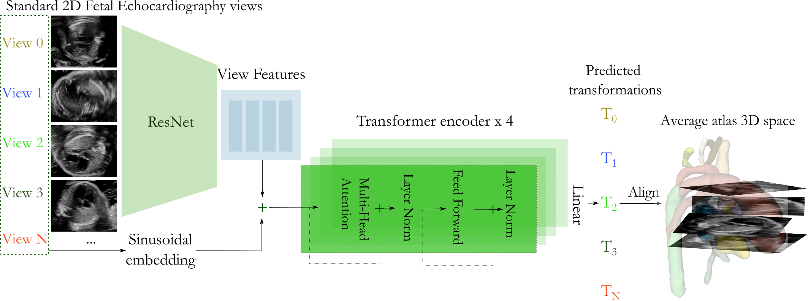

# FERN: a Fetal Echocardiography Network for 2D-to-3D Registration

This repository contains the code and models used in the MIDL 2025 paper for 2D-to-3D standard fetal echocardiography view registration. 


This repository is based on the official implementation of SVoRT (Xu et al., 2022) (https://arxiv.org/abs/2206.10802 , https://github.com/daviddmc/SVoRT), with modifications for the experiments and dataset in our paper:

**FERN: A Fetal Echocardiography Registration Network for 2D-to-3D Alignment**

Authors: Paula Ramirez Gilliland, David F A Lloyd, Jacqueline Matthew, Reza Razavi, Milou PM Van Poppel, Andrew P. King, Maria Deprez.

Code changes include: transformation sampling adaptation to decorrelated standard views _(transform.py, random_angle)_, coarse positional standard view indexing _(scan.py)_, training with slice loss _(train.py)_ , data augmentation strategies for accurate fetal cardiac alignment (random sparse input), and evaluation quantitative and similarity metrics _(pred_full_res.py, test.py)_.


 


## Requirements 

- python 3.9
- pytorch 1.10
- pyyaml
- scikit-image
- antpy
- scipy
- nibabel
- monai 1.3.1
- pandas


### Modify hyperparameters

As in the original SVoRT, the hyperparameters of data simulation and model are stored in ```./src/config/```.

In dataset.yaml config file, we additionally include the option to add in standard view types at test time, 2D echocardiography and paired STIC volumes, as well as an atlas. 

The scan.yaml config file includes data specific hyperparameters, such as expected standard view slice index in atlas space and resolution. 

### Run the training script

```
python train.py --config ./config/config_SVoRTv2.yaml \
                --output ../results/SVoRTv2
```


## Testing

```
python test.py --config ./config/config_SVoRTv2.yaml \
               --output ../results/SVoRTv2/test_output \
               --checkpoint ../results/SVoRTv2/checkpoint.pt
```

### Running on higher resolution grid 

```
python pred_full_res.py --config ./config/config_SVoRTv2.yaml \
               --transforms ../results/SVoRTv2/transforms_npy \
               --output ../results/SVoRTv2/test_output \
               
```


## Contact

For questions, please email: paula.ramirez_gilliland@kcl.ac.uk
